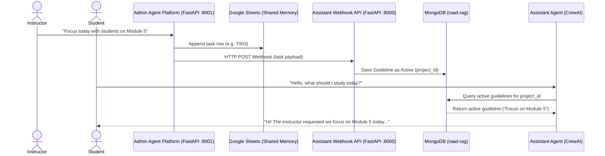

# 🎓 Raaed — Educational Multi-Agent & RAG Platform

> **رائد (Raaed)** is a production-grade, multi-agent educational assistant platform designed to help university students study course materials.
> Powered by a two-stage **Retrieval-Augmented Generation (RAG)** pipeline, a conversational **AI Study Assistant** agent, an instructor-facing **Admin Agent**, and a **Google Sheets / Webhook-based shared memory** task queue.
>
> Developed for the **Digital Pioneers Initiative | AI Learning Assistant v2.0**

---

## 🏗️ System Architecture

Raaed operates as a dual-agent system where instructors can direct the AI Study Assistant's behavior in real-time through an Instructor Admin Agent.



---

## 📂 Project Directory Structure

```
├── src/                             # 🚀 Raaed Core Assistant API
│   ├── main.py                      #   FastAPI entry point (lifespan manager)
│   ├── controllers/                 #   Business logic layer (Data, NLP, Process)
│   ├── routes/                      #   FastAPI route routing schemas
│   ├── models/                      #   Pydantic schemes and MongoDB models
│   ├── stores/                      #   LLM providers & Qdrant vector database clients
│   ├── chunking/                    #   Heading-based semantic text splitters
│   ├── embedding/                   #   Vector embedding client wrappers
│   ├── search/                      #   BGE Reranker search prototypes
│   ├── scripts/                     #   Database setup and seeding scripts
│   └── evaluation/                  #   📊 RAG Evaluation Framework
│
├── admin_agent_platform/            # 👨‍🏫 Instructor Admin Agent API
│   ├── main.py                      #   FastAPI Admin Agent entry point
│   ├── crew.py                      #   CrewAI Request Analyzer workflow
│   ├── google_sheets_writer.py      #   Google Sheets Shared Memory writer
│   └── test_api.py                  #   Instructor simulation test client
│
├── environment.yml                  #   Conda environment configuration
├── requirements.txt                 #   Pip python dependencies
└── README.md                        #   Project documentation
```

---

## 🚀 Setup & Installation (From Scratch)

Follow these steps sequentially to set up and run both servers locally.

### 1. Prerequisites
- **Python**: Version 3.10 or 3.11 is required.
- **MongoDB**: A running instance of MongoDB (either locally or MongoDB Atlas).
- **Conda (Recommended)**: For managing virtual environments.

### 2. Environment Configurations

You need to set up two `.env` files. 

#### A. Configure Raaed Core API Environment
Create `src/.env` and insert your credentials:
```env
APP_NAME="RAAED"
APP_VERSION="0.2"

# MongoDB Credentials
MONGODB_URL="your-mongodb-atlas-url-or-local"
MONGODB_DATABASE="raad-rag"

# LLM Providers (OpenRouter)
GENERATION_BACKEND="OPENAI"
EMBEDDING_BACKEND="LOCAL"
OPENAI_API_URL="https://openrouter.ai/api/v1"
OPENAI_API_KEY="your-openrouter-api-key"
GENERATION_MODEL_ID="openai/gpt-4o-mini"

# Local Embedding & Reranker Settings
EMBEDDING_MODEL_ID="Alibaba-NLP/gte-multilingual-base"
EMBEDDING_MODEL_SIZE=768
VECTOR_DB_BACKEND="QDRANT"
VECTOR_DB_PATH="raad_qdrant_db"
VECTOR_DB_DISTANCE_METHOD="cosine"

# Optimization (Crucial to prevent RAG prompt truncation)
INPUT_DAFAULT_MAX_CHARACTERS=16384
```

#### B. Configure Admin Agent Environment
Create `admin_agent_platform/.env` and insert your credentials:
```env
# OpenRouter API settings
OPENAI_API_KEY="your-openrouter-api-key"
OPENAI_API_URL="https://openrouter.ai/api/v1"
GENERATION_MODEL_ID="openai/gpt-4o-mini"

# Google Sheets API Shared Memory
GOOGLE_SPREADSHEET_ID="your-google-spreadsheet-id"
GOOGLE_CLIENT_ID="your-google-client-id"
GOOGLE_CLIENT_SECRET="your-google-client-secret"

# Assistant Webhook URL (pointing to Raaed Core API)
ASSISTANT_WEBHOOK_URL="http://localhost:8000/api/v1/agent/webhook/task"
```

### 3. Install Dependencies
Set up the Conda environment using `environment.yml` or standard pip:

```bash
# Using Conda
conda env create -f environment.yml
conda activate raed

# OR using pip inside a virtual environment
pip install -r requirements.txt
```

### 4. Database Setup & Seeding
Prepare MongoDB databases, collections, indexes, and write initial dummy project records:

```bash
cd src
# Seeds 'testproject1' with PDF chunks in MongoDB
python -m scripts.seed_db --seed
```

### 5. Synchronizing Vector Database
Push the database chunks to Qdrant to generate embeddings:
1. Start the core server first (see step 6 below).
2. Execute a POST request via curl or python:
```bash
wsl curl -X POST http://127.0.0.1:8000/api/v1/nlp/index/push/testproject1 -H "Content-Type: application/json" -d '{"do_reset": true}'
```

---

## 📡 Running the Applications

To run the full dual-agent system, start both FastAPI servers:

### Start Raaed Core API (Assistant Server)
Runs on port **8000** by default:
```bash
cd src
uvicorn main:app --reload --host 0.0.0.0 --port 8000
```
* **Swagger Documentation**: [http://localhost:8000/docs](http://localhost:8000/docs)

### Start Admin Agent API (Instructor Server)
Runs on port **8001** by default:
```bash
cd admin_agent_platform
uvicorn main:app --reload --host 0.0.0.0 --port 8001
```
* **Swagger Documentation**: [http://localhost:8001/docs](http://localhost:8001/docs)

---

## 📊 RAG Evaluation Framework & Performance

Raaed includes a built-in evaluation framework inside `src/evaluation/` to measure retrieval effectiveness and generation accuracy.

### 1. Retrieval Performance (Vector Search vs BGE Reranker)
Standard cosine similarity vector search alone compared against vector retrieval + **BGE Cross-Encoder Reranker** (`BAAI/bge-reranker-v2-m3`):

| Metric | Vector Search (GTE Only) | Reranked Search (GTE + BGE) |
| :--- | :---: | :---: |
| **Hit Rate @ 1** | 66.7% | **100.0%** (Perfect precision) |
| **Hit Rate @ 3** | 100.0% | 100.0% |
| **Hit Rate @ 5** | 100.0% | 100.0% |
| **MRR (Mean Reciprocal Rank)** | 0.8222 | **1.0000** |
| **NDCG @ 5** | 0.8682 | **1.0000** |

* **Impact**: The BGE Reranker ensures that the correct context is placed first in 100% of queries.

### 2. Generation Quality (RAG System vs Raw LLM Baseline)
Evaluating RAG answers against textbook facts and a raw model (`gpt-4o-mini` without context):

| Metric | RAG Pipeline (With Context) | Raw LLM Baseline (No Context) |
| :--- | :---: | :---: |
| **Faithfulness** (No Hallucinations) | **100.0%** | N/A |
| **Answer Relevancy** | **99.3%** | 100.0% |
| **ROUGE-L F1** (Overlap) | **0.5356** | 0.3972 |
| **Semantic Similarity** (Cosine) | **0.8961** | 0.8553 |

* **Impact**: Grounding the model in course documents achieves **100.0% Faithfulness** while matching the textbook content significantly better (ROUGE-L F1 of **0.5356** vs **0.3972**).

### 3. How to Run the Evaluation Suite
1. Stop the FastAPI dev server on port 8000 (to release the SQLite/Qdrant file lock).
2. Execute the evaluation script:
   ```bash
   cd src
   python evaluation/evaluate_rag.py
   ```
3. Granular results are saved in `src/evaluation/evaluation_results.json`.

---

## 📡 API Endpoint Reference

### Raaed Core API (Port 8000)
| Method | Endpoint | Description |
| :--- | :--- | :--- |
| `POST` | `/api/v1/data/upload/{project_id}` | Upload PDF lecture file |
| `POST` | `/api/v1/data/process/{project_id}` | Extract, chunk, and save PDF data |
| `POST` | `/api/v1/nlp/index/push/{project_id}` | Index chunks from MongoDB to Qdrant Vector DB |
| `POST` | `/api/v1/nlp/index/search/{project_id}` | Two-stage semantic search with BGE reranking |
| `POST` | `/api/v1/nlp/index/answer/{project_id}` | RAG-based QA endpoint |
| `POST` | `/api/v1/agent/chat/{project_id}` | Conversational study assistant |
| `POST` | `/api/v1/agent/quiz/{project_id}` | Quiz generator sub-agent |
| `POST` | `/api/v1/agent/webhook/task` | Endpoint to receive instructor guidelines from Admin Agent |

### Admin Agent API (Port 8001)
| Method | Endpoint | Description |
| :--- | :--- | :--- |
| `POST` | `/task/create` | Receive natural language task from instructor, analyze it using CrewAI, write to Google Sheets, and trigger Assistant webhook |

---

## 📄 License

This project is licensed under the [AGPL-3.0 License](LICENSE).