# 📘 Raaed — Complete System Documentation

> **رائد (Raaed)** — An AI-powered educational assistant platform for university students.  
> _Digital Pioneers Initiative | AI Learning Assistant v2.0_

---

## Table of Contents

1. [Project Overview](#1-project-overview)
2. [High-Level System Architecture](#2-high-level-system-architecture)
3. [Detailed Component Architecture](#3-detailed-component-architecture)
4. [Data Flow — End-to-End Pipeline](#4-data-flow--end-to-end-pipeline)
5. [Module Reference](#5-module-reference)
   - [5.1 PDF Extraction Pipeline](#51-pdf-extraction-pipeline)
   - [5.2 Semantic Chunking Engine](#52-semantic-chunking-engine)
   - [5.3 Embedding & Vector Storage](#53-embedding--vector-storage)
   - [5.4 RAG Pipeline (Retrieval + Generation)](#54-rag-pipeline-retrieval--generation)
   - [5.5 AI Agent System (CrewAI)](#55-ai-agent-system-crewai)
   - [5.6 Admin Agent Platform](#56-admin-agent-platform)
   - [5.7 Inter-Agent Communication](#57-inter-agent-communication)
6. [Database Architecture](#6-database-architecture)
7. [API Reference](#7-api-reference)
8. [Configuration Reference](#8-configuration-reference)
9. [Directory Structure](#9-directory-structure)
10. [Deployment & Running](#10-deployment--running)
11. [RAG Evaluation Framework & Performance Metrics](#11-rag-evaluation-framework--performance-metrics)

---

## 1. Project Overview

**Raaed** is a Retrieval-Augmented Generation (RAG) platform designed to help university students study their course materials more effectively. The system processes uploaded lecture PDFs, extracts and chunks the content semantically, stores it in a vector database, and provides an AI-powered conversational assistant that can answer questions, generate quizzes, and follow instructor guidelines — all grounded in the actual course materials.

### Key Capabilities

| Capability | Description |
|---|---|
| 📄 PDF Processing | Extracts text from lecture slides/PDFs using Docling + OCR fallback |
| 🔪 Semantic Chunking | Splits documents into meaningful sections based on Markdown headings |
| 🔍 Vector Search | Embeds chunks and performs cosine similarity search via Qdrant |
| 🔁 BGE Reranking | Re-scores retrieved documents with a cross-encoder for precision |
| 🤖 AI Study Assistant | Conversational agent ("رائد") that answers questions from course materials |
| 📝 Quiz Generator | Sub-agent that generates structured MCQ quizzes from retrieved content |
| 👨‍🏫 Admin Agent | Instructor-facing agent that creates tasks and steers the assistant via webhooks |
| 📊 Shared Memory | Google Sheets-based task queue + MongoDB guidelines for inter-agent communication |

---

## 2. High-Level System Architecture

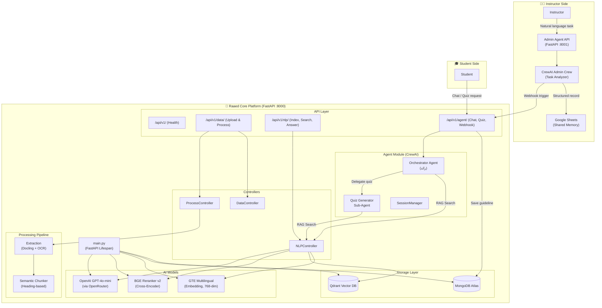

---

## 3. Detailed Component Architecture

### 3.1 Raaed Core Platform Architecture

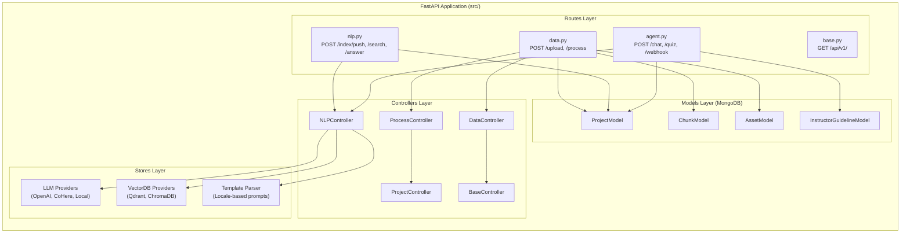

### 3.2 Agent System Architecture

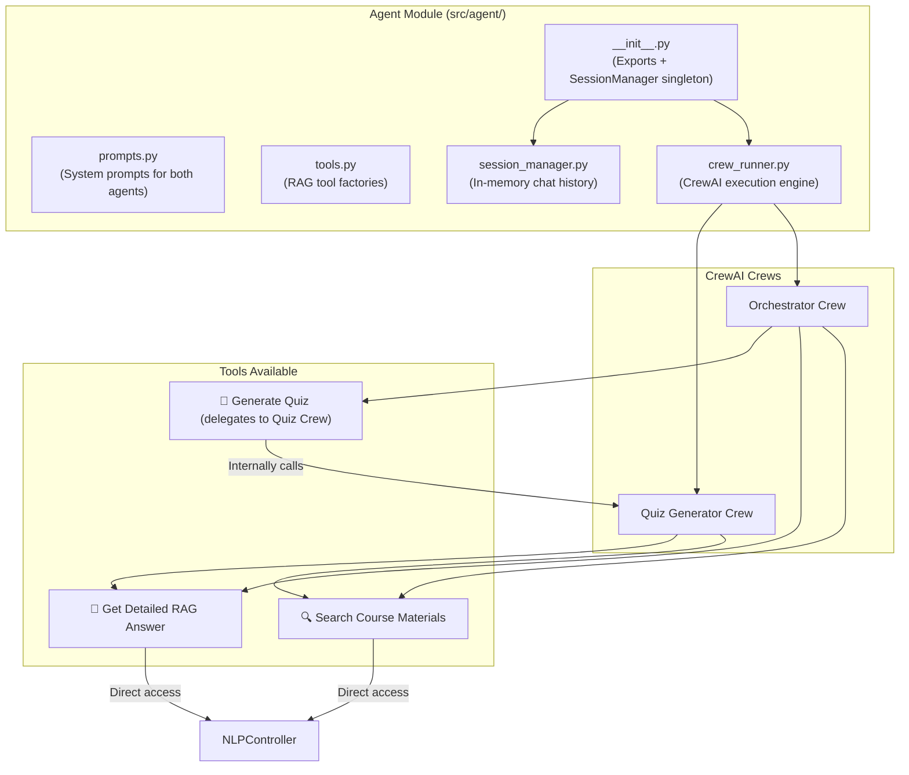

### 3.3 Admin Agent Platform Architecture

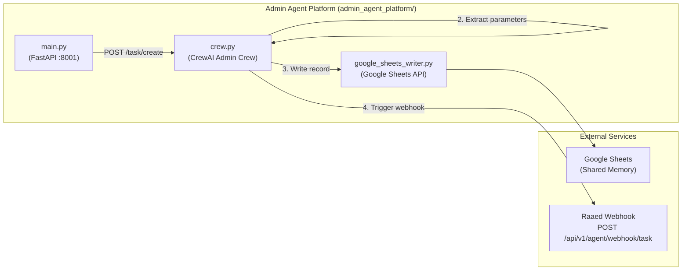

---

## 4. Data Flow — End-to-End Pipeline

### 4.1 Document Ingestion Flow

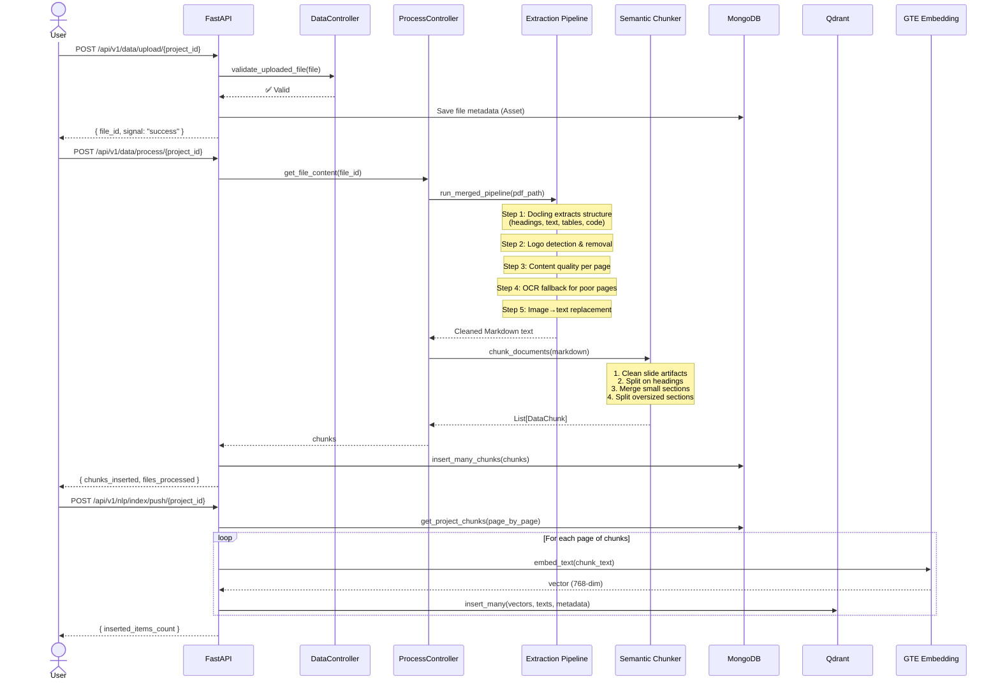

### 4.2 RAG Query Flow

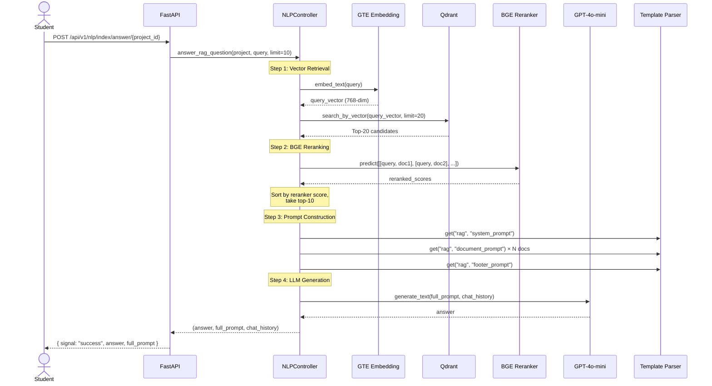

### 4.3 Agent Chat Flow

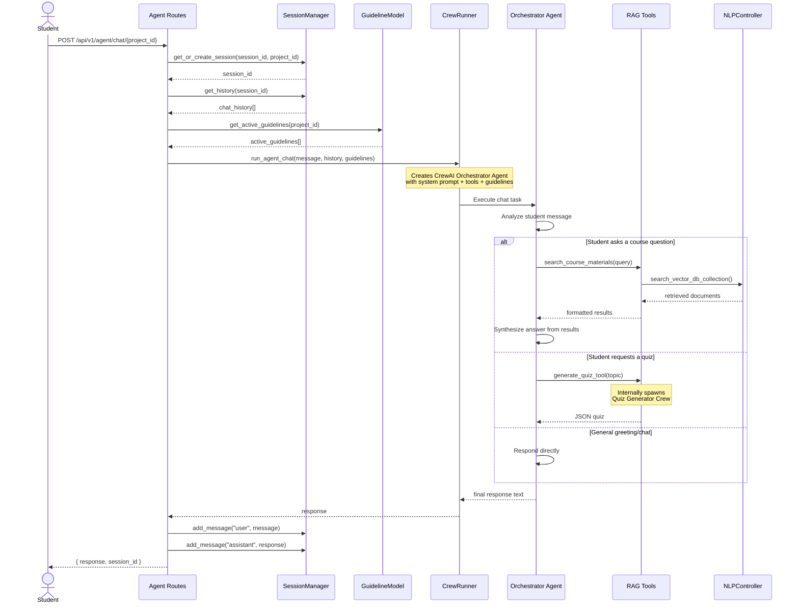

### 4.4 Instructor → Admin → Assistant Flow

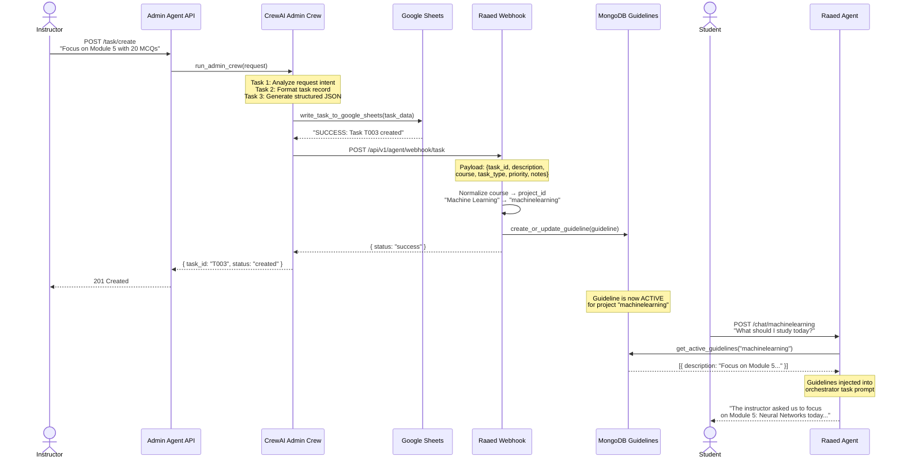

---

## 5. Module Reference

### 5.1 PDF Extraction Pipeline

**Location:** `src/extraction/`

The extraction pipeline converts uploaded PDFs into clean Markdown text. It uses a hybrid approach combining **Docling** (for structural extraction) with **PyMuPDF + PaddleOCR** (as a fallback for image-heavy pages).

| File | Purpose |
|---|---|
| `docling_pipeline.py` | Primary extraction via Docling library — extracts headings, sections, tables, code blocks, and math |
| `local_pdf_pipeline.py` | Fallback pipeline using PyMuPDF rendering + PaddleOCR + optional Ollama Vision |
| `merged_pipeline.py` | **Orchestrator** that runs Docling first, detects logos, assesses page quality, and applies OCR fallback |

**Pipeline Steps:**
1. **Docling Extraction** → Structural Markdown (headings, tables, code, math)
2. **Logo Detection** → Identify small, repeated base64 images → Remove
3. **Image Content Extraction** → Replace remaining images with OCR/vision text
4. **Content Quality Assessment** → Find pages with <30 characters of text
5. **OCR Fallback** → Re-extract poor pages via PyMuPDF + PaddleOCR
6. **Cleanup** → Remove excessive blank lines, empty sections

---

### 5.2 Semantic Chunking Engine

**Location:** `src/chunking/semantic_chunker.py`

Splits cleaned Markdown into semantically coherent chunks based on heading structure.

| Parameter | Value | Purpose |
|---|---|---|
| `MAX_TOKENS` | 1000 | Maximum tokens per chunk |
| `MIN_TOKENS` | 80 | Minimum tokens — smaller sections are merged |
| `OVERLAP_RATIO` | 0.17 | 17% overlap between split sub-chunks |
| `ENCODING_MODEL` | `cl100k_base` | Tiktoken encoding for token counting |

**Algorithm:**
1. **Pre-processing** — Clean slide artifacts (empty headings, duplicates, base64 noise)
2. **Section Splitting** — Split at every `##` heading boundary
3. **Merge Small** — Sections < `MIN_TOKENS` merged with the next section
4. **Split Large** — Sections > `MAX_TOKENS` recursively split using `RecursiveCharacterTextSplitter`

**Output per chunk:**
```python
{
    "chunk_id": "Python_Session_1.md_c0",
    "chunk_content": "## Heading\n\nBody text...",
    "source": "Python_Session_1.md",
    "section_heading": "Heading",
    "chunk_index": 0,
    "token_count": 450
}
```

---

### 5.3 Embedding & Vector Storage

#### Embedding Model
| Property | Value |
|---|---|
| Model | `Alibaba-NLP/gte-multilingual-base` |
| Type | Local (runs on device) |
| Dimensions | 768 |
| Multilingual | ✅ Arabic + English |

#### Vector Database — Qdrant
| Property | Value |
|---|---|
| Backend | Qdrant (local persistent storage) |
| Distance Method | Cosine Similarity |
| Storage Path | `src/assets/database/raad_qdrant_db/` |
| Collection Naming | `collection_{project_id}` |

---

### 5.4 RAG Pipeline (Retrieval + Generation)

**Location:** `src/controllers/NLPController.py`

The RAG pipeline implements a **two-stage retrieval** system:

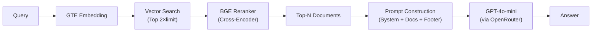

**Stage 1 — Vector Retrieval:**
- Embed query using GTE multilingual
- Search Qdrant for `2 × limit` candidates (over-retrieve)
- Returns documents with cosine similarity scores

**Stage 2 — BGE Reranking:**
- Model: `BAAI/bge-reranker-v2-m3` (Cross-Encoder)
- Re-scores all candidate pairs `[query, document]`
- Sort by reranker score descending
- Return top `limit` documents

**Stage 3 — Answer Generation:**
- Construct prompt from locale templates (`stores/llm/templates/locales/en/rag.py`)
- Send to `openai/gpt-4o-mini` via OpenRouter
- Return grounded answer

---

### 5.5 AI Agent System (CrewAI)

**Location:** `src/agent/`

The agent system uses **CrewAI** to create intelligent, tool-using agents that sit on top of the RAG pipeline.

#### Orchestrator Agent ("رائد")

| Property | Value |
|---|---|
| Role | Study Assistant |
| Personality | Encouraging, supportive, patient — a study companion |
| Language | Matches the student (Arabic or English) |
| Framework | CrewAI with OpenRouter LLM |
| Tools | Search Course Materials, Get RAG Answer, Generate Quiz |

**Behavioral Rules:**
- Uses RAG tools for subject-specific questions
- Responds directly for general conversation
- Delegates quiz generation to the Quiz sub-agent
- Injects active instructor guidelines into its reasoning

#### Quiz Generator Sub-Agent

| Property | Value |
|---|---|
| Role | Quiz Generator Specialist |
| Output | Structured JSON (`QuizModel`) |
| Format | MCQ with 4 options (A/B/C/D), correct answer, explanation |
| Source | Always grounded in retrieved course materials |

#### Session Manager

| Property | Value |
|---|---|
| Storage | In-memory (Python dict) |
| Max History | 50 messages per session |
| Session ID | UUID4 |
| Persistence | Ephemeral (lost on server restart) |

---

### 5.6 Admin Agent Platform

**Location:** `admin_agent_platform/`

A separate FastAPI service that processes instructor requests using CrewAI.

#### Workflow
1. Instructor sends a natural language request (e.g., "Create a quiz about ML Chapter 3 with 20 MCQs")
2. CrewAI Admin Crew analyzes intent → extracts parameters → formats structured JSON
3. Record is written to Google Sheets (Shared Memory)
4. Webhook notification is sent to the Raaed Assistant

#### Google Sheets Schema ("Shared Memory")
| Column | Description |
|---|---|
| Task_ID | Auto-generated (T001, T002, ...) |
| Task_Type | Quiz, Assignment, Flashcards, Study Guide, Summary, Exam |
| Description | Clear description of the task |
| Course | Subject name (default: "General") |
| Priority | High, Medium, Low |
| Assigned_Agent | Always "TA" |
| Status | Pending, In Progress, Completed |
| Created_At | Timestamp |
| Notes | Extracted parameters (MCQ count, chapters, etc.) |

---

### 5.7 Inter-Agent Communication

The Admin Agent and Assistant Agent communicate through two mechanisms:

#### 1. Webhook Trigger (Real-Time)
When the Admin Agent creates a task, it immediately sends an HTTP POST to the Assistant Agent's webhook endpoint. This stores the instructor's guideline in MongoDB as an active directive.

#### 2. Active Guidelines Injection
When a student chats with the Assistant Agent, it queries MongoDB for all active guidelines for the student's `project_id`. If any exist, they are injected into the orchestrator's task description, steering the conversation toward the instructor's objectives.

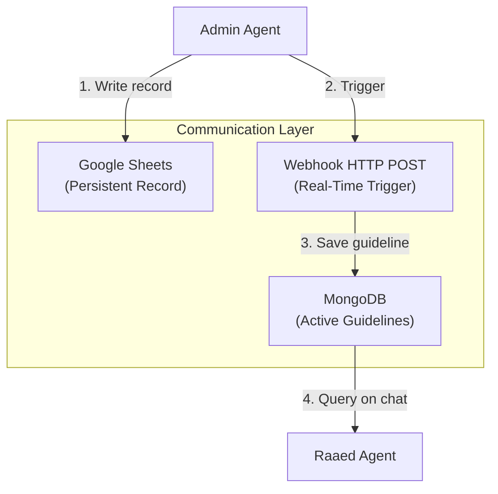

---

## 6. Database Architecture

### 6.1 MongoDB Collections

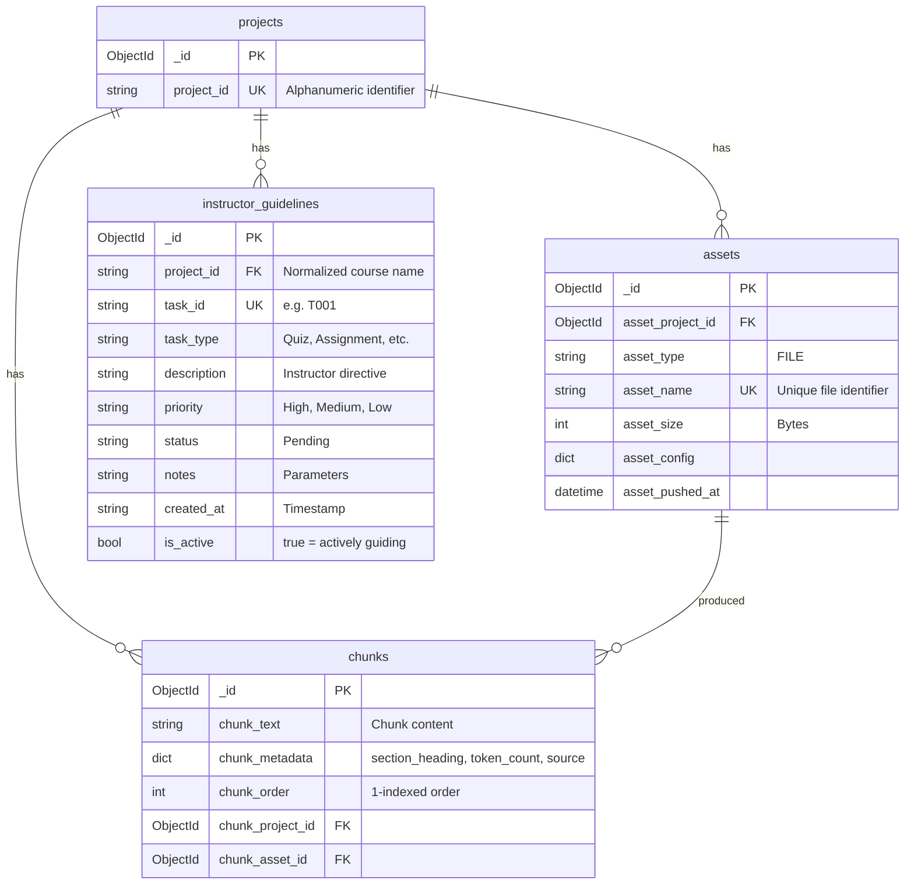

### 6.2 Vector Database (Qdrant)

Each project gets its own Qdrant collection named `collection_{project_id}`.

| Field | Type | Description |
|---|---|---|
| `id` | int | Auto-incremented chunk index |
| `vector` | float[768] | GTE embedding vector |
| `text` | string | Original chunk text |
| `metadata` | dict | section_heading, token_count, source, source_path |

---

## 7. API Reference

### 7.1 Base Routes

| Method | Endpoint | Description |
|---|---|---|
| `GET` | `/api/v1/` | Health check — returns app name and version |

---

### 7.2 Data Routes (`/api/v1/data/`)

#### `POST /api/v1/data/upload/{project_id}`

Upload a file (PDF or TXT) to a project.

| Parameter | Type | Location | Description |
|---|---|---|---|
| `project_id` | string | Path | Alphanumeric project identifier |
| `file` | UploadFile | Body (multipart) | The file to upload |

**Response (200):**
```json
{
    "signal": "file_upload_success",
    "file_id": "648a1f2b..."
}
```

#### `POST /api/v1/data/process/{project_id}`

Extract text from uploaded files and store as chunks in MongoDB.

| Parameter | Type | Location | Description |
|---|---|---|---|
| `project_id` | string | Path | Project identifier |
| `file_id` | string? | Body | Specific file to process (optional — processes all if omitted) |
| `chunk_size` | int? | Body | Chunk size parameter (default: 100) |
| `overlap_size` | int? | Body | Overlap size parameter (default: 20) |
| `do_reset` | int? | Body | If 1, deletes existing chunks first |

**Response (200):**
```json
{
    "signal": "processing_success",
    "inserted_chunks": 42,
    "processed_files": 1
}
```

---

### 7.3 NLP Routes (`/api/v1/nlp/`)

#### `POST /api/v1/nlp/index/push/{project_id}`

Index all chunks from MongoDB into the Qdrant vector database.

| Parameter | Type | Location | Description |
|---|---|---|---|
| `project_id` | string | Path | Project identifier |
| `do_reset` | int? | Body | If 1, resets the vector collection |

**Response (200):**
```json
{
    "signal": "insert_into_vectordb_success",
    "inserted_items_count": 42
}
```

#### `GET /api/v1/nlp/index/info/{project_id}`

Get vector collection metadata.

**Response (200):**
```json
{
    "signal": "vectordb_collection_retrieved",
    "collection_info": { "vectors_count": 42, "status": "green" }
}
```

#### `POST /api/v1/nlp/index/search/{project_id}`

Perform semantic vector search with optional BGE reranking.

| Parameter | Type | Location | Description |
|---|---|---|---|
| `project_id` | string | Path | Project identifier |
| `text` | string | Body | Search query |
| `limit` | int? | Body | Number of results (default: 5) |

**Response (200):**
```json
{
    "signal": "vectordb_search_success",
    "results": [
        { "text": "...", "score": 0.892 }
    ]
}
```

#### `POST /api/v1/nlp/index/answer/{project_id}`

Full RAG pipeline: retrieve → rerank → generate answer.

| Parameter | Type | Location | Description |
|---|---|---|---|
| `project_id` | string | Path | Project identifier |
| `text` | string | Body | User's question |
| `limit` | int? | Body | Number of documents to retrieve (default: 5) |

**Response (200):**
```json
{
    "signal": "rag_answer_success",
    "answer": "Based on the course materials, ...",
    "full_prompt": "...",
    "chat_history": [...]
}
```

---

### 7.4 Agent Routes (`/api/v1/agent/`)

#### `POST /api/v1/agent/chat/{project_id}`

Multi-turn chat with the Raaed Study Assistant.

| Parameter | Type | Location | Description |
|---|---|---|---|
| `project_id` | string | Path | Project identifier |
| `message` | string | Body | Student's message |
| `session_id` | string? | Body | Existing session ID (creates new if omitted) |

**Response (200):**
```json
{
    "response": "Hello! Based on Module 5...",
    "session_id": "a1b2c3d4-..."
}
```

#### `POST /api/v1/agent/quiz/{project_id}`

Generate a structured MCQ quiz from course materials.

| Parameter | Type | Location | Description |
|---|---|---|---|
| `project_id` | string | Path | Project identifier |
| `topic` | string | Body | Quiz topic |
| `num_questions` | int? | Body | Number of questions (default: 5) |

**Response (200):**
```json
{
    "quiz": {
        "topic": "Neural Networks",
        "questions": [
            {
                "question": "What is the activation function...?",
                "options": {"A": "...", "B": "...", "C": "...", "D": "..."},
                "correct_answer": "B",
                "explanation": "B is correct because..."
            }
        ]
    }
}
```

#### `DELETE /api/v1/agent/session/{session_id}`

Clear a chat session's history.

**Response (200):**
```json
{ "status": "cleared" }
```

#### `POST /api/v1/agent/webhook/task`

Receive task notifications from the Admin Agent.

| Parameter | Type | Location | Description |
|---|---|---|---|
| `task_id` | string | Body | Task ID (e.g., "T003") |
| `description` | string | Body | Task description |
| `course` | string | Body | Course name (auto-normalized to project_id) |
| `task_type` | string | Body | Quiz, Assignment, etc. |
| `priority` | string | Body | High, Medium, Low |
| `notes` | string? | Body | Additional parameters |

**Response (200):**
```json
{
    "status": "success",
    "message": "Guideline successfully registered for project: machinelearning",
    "project_id": "machinelearning",
    "task_id": "T003"
}
```

---

### 7.5 Admin Agent API (`admin_agent_platform/`)

#### `POST /task/create`

Create a new task via natural language.

| Parameter | Type | Location | Description |
|---|---|---|---|
| `request` | string | Body | Natural language task request |

**Response (201):**
```json
{
    "task_id": "T003",
    "status": "created"
}
```

#### `GET /health`

Health check for the Admin Agent service.

**Response (200):**
```json
{ "status": "healthy", "service": "Admin Agent Platform" }
```

---

## 8. Configuration Reference

### 8.1 Core Platform (`src/.env`)

| Variable | Description | Example |
|---|---|---|
| `APP_NAME` | Application name | `RAAED` |
| `APP_VERSION` | Application version | `0.1` |
| `OPENAI_API_KEY` | OpenRouter API key | `sk-or-v1-...` |
| `OPENAI_API_URL` | LLM API base URL | `https://openrouter.ai/api/v1` |
| `MONGODB_URL` | MongoDB Atlas connection string | `mongodb+srv://...` |
| `MONGODB_DATABASE` | Database name | `raad-rag` |
| `GENERATION_BACKEND` | LLM provider | `OPENAI` |
| `EMBEDDING_BACKEND` | Embedding provider | `LOCAL` |
| `GENERATION_MODEL_ID` | Generation model | `openai/gpt-4o-mini` |
| `EMBEDDING_MODEL_ID` | Embedding model | `Alibaba-NLP/gte-multilingual-base` |
| `EMBEDDING_MODEL_SIZE` | Embedding dimensions | `768` |
| `VECTOR_DB_BACKEND` | Vector DB provider | `QDRANT` |
| `VECTOR_DB_PATH` | Vector DB storage path | `raad_qdrant_db` |
| `VECTOR_DB_DISTANCE_METHOD` | Similarity metric | `cosine` |
| `PRIMARY_LANG` | Primary template language | `en` |
| `INPUT_DAFAULT_MAX_CHARACTERS` | Max input characters | `1024` |
| `GENERATION_DAFAULT_MAX_TOKENS` | Max generation tokens | `200` |
| `GENERATION_DAFAULT_TEMPERATURE` | LLM temperature | `0.1` |

### 8.2 Admin Agent (`admin_agent_platform/.env`)

| Variable | Description | Example |
|---|---|---|
| `OPENAI_API_KEY` | OpenRouter API key | `sk-or-v1-...` |
| `OPENAI_API_URL` | LLM API base URL | `https://openrouter.ai/api/v1` |
| `GENERATION_MODEL_ID` | Model for task analysis | `openai/gpt-4o-mini` |
| `GOOGLE_SPREADSHEET_ID` | Google Sheets spreadsheet ID | `1wMtkgZ...` |
| `GOOGLE_CLIENT_ID` | OAuth2 client ID | `72549...` |
| `GOOGLE_CLIENT_SECRET` | OAuth2 client secret | `GOCSPX-...` |
| `ASSISTANT_WEBHOOK_URL` | Raaed webhook endpoint | `http://localhost:8000/api/v1/agent/webhook/task` |

---

## 9. Directory Structure

```
Raaed-Graduation-Project/
│
├── src/                                    # 🧠 Core Platform
│   ├── main.py                             # FastAPI app + lifespan (startup/shutdown)
│   ├── .env                                # Environment configuration
│   │
│   ├── agent/                              # 🤖 AI Agent System
│   │   ├── __init__.py                     # Exports + SessionManager singleton
│   │   ├── crew_runner.py                  # CrewAI execution engine (Orchestrator + Quiz)
│   │   ├── prompts.py                      # System prompts for both agents
│   │   ├── session_manager.py              # In-memory chat session store
│   │   └── tools.py                        # CrewAI tool factories (RAG wrappers)
│   │
│   ├── controllers/                        # 🎮 Business Logic Controllers
│   │   ├── BaseController.py               # Base class (paths, config)
│   │   ├── DataController.py               # File validation
│   │   ├── NLPController.py                # RAG: embed, search, rerank, answer
│   │   ├── ProcessController.py            # PDF extraction + chunking orchestration
│   │   └── ProjectController.py            # Project directory management
│   │
│   ├── extraction/                         # 📄 PDF → Markdown Pipeline
│   │   ├── docling_pipeline.py             # Docling structural extraction
│   │   ├── local_pdf_pipeline.py           # PyMuPDF + PaddleOCR + Ollama Vision
│   │   └── merged_pipeline.py              # Hybrid orchestrator pipeline
│   │
│   ├── chunking/                           # 🔪 Text Chunking
│   │   └── semantic_chunker.py             # Heading-based semantic chunking
│   │
│   ├── search/                             # 🔍 Search Utilities
│   │   └── reranked_search.py              # Standalone two-stage search script
│   │
│   ├── routes/                             # 🌐 API Routes
│   │   ├── base.py                         # GET / (health check)
│   │   ├── data.py                         # Upload + Process endpoints
│   │   ├── nlp.py                          # Index, Search, Answer endpoints
│   │   ├── agent.py                        # Chat, Quiz, Webhook endpoints
│   │   └── schemes/                        # Pydantic request/response schemas
│   │       ├── data.py
│   │       ├── nlp.py
│   │       └── agent.py
│   │
│   ├── models/                             # 📦 MongoDB Models
│   │   ├── ProjectModel.py
│   │   ├── ChunkModel.py
│   │   ├── AssetModel.py
│   │   ├── InstructorGuidelineModel.py
│   │   ├── BaseDataModel.py
│   │   ├── db_schemes/                     # Pydantic schemas for MongoDB documents
│   │   │   ├── project.py
│   │   │   ├── data_chunk.py
│   │   │   ├── asset.py
│   │   │   └── instructor_guideline.py
│   │   └── enums/
│   │       ├── DataBaseEnum.py
│   │       ├── ResponseEnums.py
│   │       ├── AssetTypeEnum.py
│   │       └── ProcessingEnum.py
│   │
│   ├── stores/                             # 🏪 External Service Providers
│   │   ├── llm/                            # LLM Providers
│   │   │   ├── LLMInterface.py             # Abstract base class
│   │   │   ├── LLMEnums.py                 # Provider + role enums
│   │   │   ├── LLMProviderFactory.py       # Factory pattern
│   │   │   ├── providers/
│   │   │   │   ├── OpenAIProvider.py        # OpenAI/OpenRouter implementation
│   │   │   │   ├── CoHereProvider.py        # Cohere implementation
│   │   │   │   └── LocalEmbeddingProvider.py# Local GTE embedding
│   │   │   └── templates/
│   │   │       ├── template_parser.py       # Locale-based template loading
│   │   │       └── locales/en/
│   │   │           ├── rag.py               # RAG prompt templates
│   │   │           └── quiz.py              # Quiz generation templates
│   │   └── vectordb/                       # Vector DB Providers
│   │       ├── VectorDBInterface.py         # Abstract base class
│   │       ├── VectorDBEnums.py             # Provider enums
│   │       ├── VectorDBProviderFactory.py   # Factory pattern
│   │       └── providers/
│   │           ├── QdrantDBProvider.py       # Qdrant implementation
│   │           └── ChromaDBProvider.py       # ChromaDB implementation
│   │
│   ├── helpers/                            # 🔧 Utilities
│   │   ├── config.py                       # Pydantic Settings loader
│   │   └── db_init.py                      # MongoDB collection + index initializer
│   │
│   └── assets/                             # 📁 Local Storage
│       ├── files/{project_id}/             # Uploaded files per project
│       └── database/raad_qdrant_db/        # Qdrant persistent storage
│
├── admin_agent_platform/                   # 👨‍🏫 Admin Agent (Separate Service)
│   ├── main.py                             # FastAPI app (port 8001)
│   ├── crew.py                             # CrewAI Admin Crew + webhook trigger
│   ├── google_sheets_writer.py             # Google Sheets API integration
│   ├── .env                                # Admin agent configuration
│   ├── requirements.txt
│   └── test_crew.py                        # Test script
│
├── environment.yml                         # Conda environment specification
├── requirements.txt                        # Python dependencies
├── setup_env.sh                            # Environment setup script
└── README.md
```

---

## 10. Deployment & Running

### 10.1 Prerequisites

- Python 3.10+ (Conda recommended)
- MongoDB Atlas account (or local MongoDB)
- OpenRouter API key
- Google Cloud OAuth credentials (for Admin Agent)

### 10.2 Running the Core Platform

```bash
cd src
uvicorn main:app --reload --port 8000
```

The server starts up by:
1. Connecting to MongoDB Atlas
2. Initializing LLM provider (OpenRouter → GPT-4o-mini)
3. Initializing local embedding model (GTE Multilingual, 768-dim)
4. Connecting to Qdrant vector database
5. Loading BGE Reranker cross-encoder model
6. Setting up template parser (English locale)

**API Docs:** [http://localhost:8000/docs](http://localhost:8000/docs)

### 10.3 Running the Admin Agent

```bash
cd admin_agent_platform
uvicorn main:app --reload --port 8001
```

**API Docs:** [http://localhost:8001/docs](http://localhost:8001/docs)

### 10.4 Typical Usage Flow

```bash
# 1. Upload a PDF
curl -X POST http://localhost:8000/api/v1/data/upload/ml_course \
  -F "file=@lecture_5.pdf"

# 2. Process the PDF (extract + chunk)
curl -X POST http://localhost:8000/api/v1/data/process/ml_course \
  -H "Content-Type: application/json" \
  -d '{"do_reset": 0}'

# 3. Index chunks into vector DB
curl -X POST http://localhost:8000/api/v1/nlp/index/push/ml_course \
  -H "Content-Type: application/json" \
  -d '{"do_reset": 0}'

# 4. Chat with Raaed
curl -X POST http://localhost:8000/api/v1/agent/chat/ml_course \
  -H "Content-Type: application/json" \
  -d '{"message": "What is gradient descent?"}'

# 5. Generate a quiz
curl -X POST http://localhost:8000/api/v1/agent/quiz/ml_course \
  -H "Content-Type: application/json" \
  -d '{"topic": "neural networks", "num_questions": 5}'
```

## 11. RAG Evaluation Framework & Performance Metrics

To ensure the reliability, accuracy, and performance of the Raaed RAG system for the graduation project presentation, a comprehensive evaluation framework is built directly into the codebase. 

### 11.1 Framework Structure

The evaluation suite is located in `src/evaluation/` and consists of the following components:

- **`generate_dataset.py`**: Retrieves course document chunks from MongoDB and uses the production LLM (`gpt-4o-mini`) with robust parsing fallbacks to generate a static evaluation dataset of 15 Question-Answer-Context triples.
- **`evaluate_rag.py`**: The evaluation runner script that loads the dataset, executes tests on both the retrieval and generation stages, computes multiple metrics, and compares results.
- **`test_dataset.json`**: The static evaluation Q&A dataset representing standard student queries and textbook answers.
- **`evaluation_results.json`**: Output containing granular metrics and generated answers for every test case.

---

### 11.2 Evaluation Metrics

The framework evaluates the RAG pipeline across three dimensions:

#### 1. Retrieval Quality (Vector Search vs BGE Reranker)
This evaluates how effectively the vector database retrieves the exact textbook chunk containing the answer. We compare standard cosine similarity vector search alone against our two-stage pipeline with a **BGE Cross-Encoder Reranker** (`BAAI/bge-reranker-v2-m3`).

| Metric | Description | Vector Search (GTE Only) | Reranked Search (GTE + BGE) |
| :--- | :--- | :---: | :---: |
| **Hit Rate @ 1** | Is the correct document ranked 1st? | 66.7% | **100.0%** |
| **Hit Rate @ 3** | Is the correct document in the top 3? | 100.0% | **100.0%** |
| **Hit Rate @ 5** | Is the correct document in the top 5? | 100.0% | **100.0%** |
| **MRR** | Mean Reciprocal Rank of the correct document | 0.8222 | **1.0000** |
| **NDCG @ 5** | Normalized Discounted Cumulative Gain | 0.8682 | **1.0000** |

* **Key Outcome**: The BGE Reranker successfully boosts Hit Rate @ 1 to **100.0%**, ensuring that the AI assistant always reads the exact, relevant section of the textbook before generating answers.

#### 2. Generation Quality (RAG vs Raw LLM Baseline)
This evaluates the quality, accuracy, and truthfulness of the generated answers. We compare the RAG system output against a raw LLM (`gpt-4o-mini` without textbook context).

| Metric | Evaluation Method | RAG System | Raw LLM Baseline |
| :--- | :--- | :---: | :---: |
| **Faithfulness** | LLM-as-a-Judge (Detects hallucinations) | **100.0%** | N/A |
| **Answer Relevancy** | LLM-as-a-Judge (Directly answers question) | **99.3%** | 100.0% |
| **Context Relevancy** | LLM-as-a-Judge (Text relevance filter) | **90.7%** | N/A |
| **ROUGE-L F1** | Overlap with ground-truth textbook answers | **0.5356** | 0.3972 |
| **Semantic Similarity**| Cosine similarity of text embeddings | **0.8961** | 0.8553 |

* **Key Outcome**: Grounding the model in course documents achieves **100.0% Faithfulness** (hallucination-free) while matching the textbook content significantly better (ROUGE-L F1 of **0.5356** vs **0.3972**).

#### 3. System Latency & Performance (CPU on WSL)
- **Average Retrieval Latency (GTE + BGE)**: 7.229 seconds
- **Average Generation Latency**: 9.292 seconds (includes LLM-as-a-Judge evaluation calls)
- **Average Total Request Latency**: 16.521 seconds
- **P95 Latency**: 24.809 seconds

---

### 11.3 Pipeline Optimizations & Bug Fixes
The evaluation framework identified and helped resolve two critical production issues:
1. **RAG Refusal Bug**: We discovered the question was missing from the LLM prompt. We updated `src/controllers/NLPController.py` to dynamically inject the question.
2. **Prompt Truncation**: The environment variable `INPUT_DAFAULT_MAX_CHARACTERS` in `.env` was limiting inputs to `1024` characters, truncating long textbook contexts. We increased this to `16384`.
* **Fix Impact**: These changes raised **Answer Relevancy from 26% to 99.3%** and **Faithfulness from 55.3% to 100.0%**.

---

### 11.4 Running the Evaluation

To run the evaluation suite locally:
1. Stop the FastAPI server (to unlock the local Qdrant SQLite files).
2. Execute the evaluation script inside `src/`:
   ```bash
   wsl /home/gohar/miniconda3/envs/raaed/bin/python evaluation/evaluate_rag.py
   ```
3. Granular results are saved in `src/evaluation/evaluation_results.json`.

---

> _This documentation was generated for the Raaed Graduation Project — Digital Pioneers Initiative._  
> _Last updated: June 2026_
