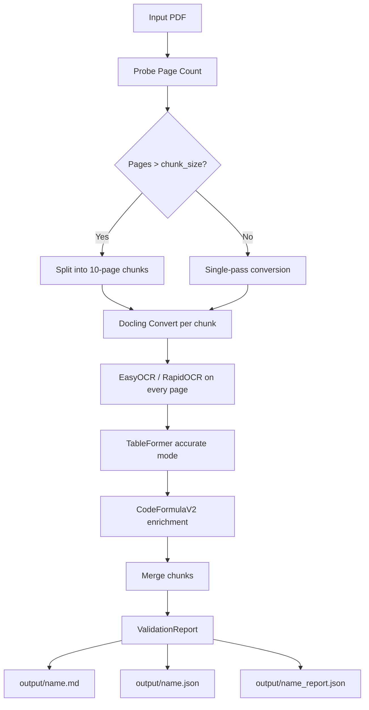
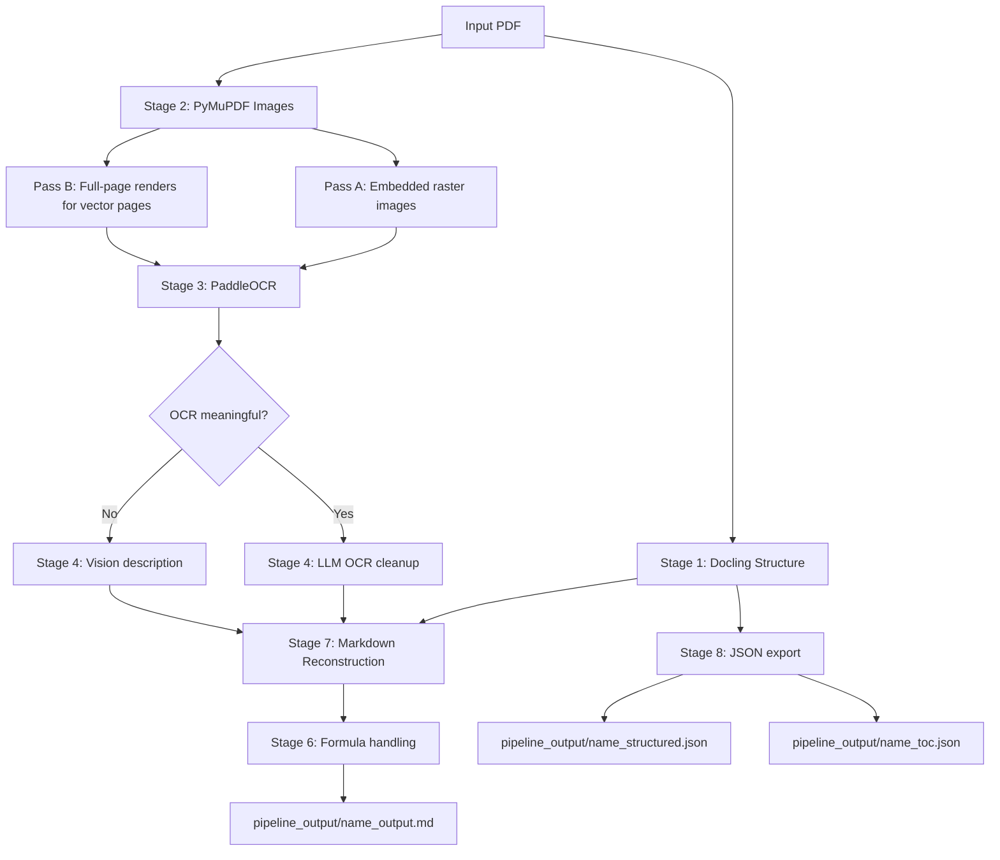

# Docling PDF Extraction Pipeline — Technical Documentation

> **Project path:** `docling-pdf-extraction-pipeline-master/`  
> **Language:** Python 3.10+  
> **Primary scripts:** `Doc.py` · `local_pdf_pipeline.py`

---

## Table of Contents

1. [Project Overview](#1-project-overview)
2. [Repository Layout](#2-repository-layout)
3. [Dependencies](#3-dependencies)
4. [Script 1 — `Doc.py` (Advanced Docling OCR Pipeline)](#4-script-1--docpy)
   - [Architecture & Design Decisions](#41-architecture--design-decisions)
   - [Key Classes & Functions](#42-key-classes--functions)
   - [Configuration Constants](#43-configuration-constants)
   - [CLI Interface](#44-cli-interface)
   - [Output Files](#45-output-files)
5. [Script 2 — `local_pdf_pipeline.py` (Full Multi-Layer Pipeline)](#5-script-2--local_pdf_pipelinepy)
   - [Stage-by-Stage Breakdown](#51-stage-by-stage-breakdown)
   - [Key Classes & Functions](#52-key-classes--functions)
   - [CLI Interface](#53-cli-interface)
   - [Output Files](#54-output-files)
6. [Comparison: `Doc.py` vs `local_pdf_pipeline.py`](#6-comparison-docpy-vs-local_pdf_pipelinepy)
7. [Data Flow Diagrams](#7-data-flow-diagrams)
8. [Configuration Reference](#8-configuration-reference)
9. [Sample PDF Files Included](#9-sample-pdf-files-included)
10. [Limitations & Known Behaviors](#10-limitations--known-behaviors)
11. [Quick-Start Commands](#11-quick-start-commands)

---

## 1. Project Overview

This project is a **production-grade PDF content extraction pipeline** built as the ingestion layer for a Retrieval-Augmented Generation (RAG) system. It solves the hard problem of converting complex, real-world PDF documents — containing native text, scanned pages, embedded images, vector graphics, tables, mathematical formulas, and code blocks — into clean, structured **Markdown** and **JSON** outputs suitable for downstream LLM processing.

The pipeline is implemented in two complementary scripts:

| Script | Role |
|---|---|
| `Doc.py` | Docling-only pipeline. High performance, page-chunked processing for large PDFs, validation reporting. |
| `local_pdf_pipeline.py` | Full multi-layer pipeline. Adds PyMuPDF image extraction, PaddleOCR, and Ollama vision/LLM integration on top of Docling. |

---

## 2. Repository Layout

```
docling-pdf-extraction-pipeline-master/
├── Doc.py                   # Script 1: Docling-only OCR pipeline
├── local_pdf_pipeline.py    # Script 2: Full multi-layer pipeline
├── README.md                # Brief project overview
├── .gitignore               # Excludes output dirs and caches
├── sample.pdf               # Sample input PDF (5 pages)
├── Math_Session_1.pdf       # Math lecture PDF (multi-page)
├── NLP Session 1.pdf        # NLP lecture PDF (multi-page)
│
├── output/                  # [generated] Doc.py outputs
│   ├── <stem>.md
│   ├── <stem>.json
│   └── <stem>_report.json
│
└── pipeline_output/         # [generated] local_pdf_pipeline.py outputs
    ├── <stem>_output.md
    ├── <stem>_structured.json
    ├── <stem>_toc.json
    ├── extracted_images/
    │   └── page_<N>_img_<M>.<ext>
    └── page_renders/
        └── page_<N>_render.png
```

> The `output/` and `pipeline_output/` directories are git-ignored and created automatically at runtime.

---

## 3. Dependencies

### Core (required by both scripts)

| Package | Purpose |
|---|---|
| `docling` | PDF parsing, layout detection, table extraction, code enrichment |
| `docling-core` | Core data models (`ImageRefMode`, etc.) |
| `docling-parse` | Low-level PDF parser used to probe page counts |

### Script 2 only (`local_pdf_pipeline.py`)

| Package | Purpose | Required? |
|---|---|---|
| `pymupdf` (fitz) | Dual-pass image extraction (embedded + page renders) | **Yes** |
| `pillow` (PIL) | Image I/O | **Yes** |
| `paddleocr` | OCR on extracted image files | Optional (graceful skip) |
| `ollama` | Vision model (image descriptions) + text LLM (OCR cleanup) | Optional (graceful skip) |

### Install

```bash
pip install docling pymupdf pillow ollama paddleocr
```

### External services

- **Ollama** — must be running locally at `http://localhost:11434` for vision/LLM features.  
  Default models used: `minicpm-v` (vision), `phi3:mini` (text cleanup).
- **GPU** — Optional but speeds up model inference. Both scripts auto-detect CUDA via `device="auto"`.

---

## 4. Script 1 — `Doc.py`

### Purpose

`Doc.py` is a **streamlined, production-hardened** pipeline that uses Docling exclusively. It is designed for:
- Large PDFs (50+ pages) via automatic page-chunking
- Maximum extraction accuracy through aggressive OCR settings
- Built-in validation reporting with pass/fail status

### 4.1 Architecture & Design Decisions

#### OCR Strategy
- **EasyOCR** is preferred over RapidOCR for higher accuracy on English text (better capitalization, punctuation, and line endings).
- `force_full_page_ocr=True` — OCR is applied to **every** page unconditionally, not just pages Docling detects as scanned. This catches mixed-content pages where native text and scanned regions coexist.
- `bitmap_area_threshold=0.01` — Even very small embedded images trigger OCR.
- `confidence_threshold=0.3` — Low threshold to minimize missed characters.
- Falls back to **RapidOCR** automatically if EasyOCR is not installed.

#### Page Chunking (Large PDF Strategy)
- Default chunk size: **10 pages**.
- For PDFs larger than `PAGE_CHUNK_SIZE`, the document is split into page-range slices, each converted independently, then **merged** into a single Markdown + JSON output.
- This prevents memory overload on 50+ page documents.
- Chunk results are merged via `merge_markdown_chunks()` and `merge_json_chunks()`.

#### Table Extraction
- Mode: `"accurate"` (vs `"fast"`) with `do_cell_matching=True`.
- Cell matching aligns detected table cells precisely with their text content.

#### Code Enrichment
- Enabled via `do_code_enrichment=True`.
- Uses the `CodeFormulaV2` vision model internally to preserve indentation and line breaks in code blocks.

#### Hardware Acceleration
- Uses `num_threads = max(4, cpu_count // 2)` — half the available cores.
- `device="auto"` selects CUDA if available, falls back to CPU.
- Batch sizes for OCR, layout, and table processing are all set to `8`.

### 4.2 Key Classes & Functions

#### `ValidationReport` (dataclass)
Tracks extraction quality after conversion. Fields:

| Field | Type | Description |
|---|---|---|
| `source` | `str` | Path to the source file |
| `total_pages_expected` | `int` | Page count probed before conversion |
| `total_pages_extracted` | `int` | Pages actually processed |
| `total_text_elements` | `int` | Count of text items in output JSON |
| `total_tables` | `int` | Count of tables |
| `total_pictures` | `int` | Count of pictures |
| `total_code_blocks` | `int` | Count of fenced code blocks in Markdown |
| `empty_pages` | `list[int]` | Pages with no content |
| `warnings` | `list[str]` | Non-fatal issues |
| `errors` | `list[str]` | Fatal/partial failures |
| `processing_time_sec` | `float` | Wall-clock time |
| `status` | `str` | `PASS` / `PASS_WITH_WARNINGS` / `FAIL` |

**Status logic:**
- `FAIL` if page coverage < 80%
- `PASS_WITH_WARNINGS` if any errors logged
- `PASS` if everything succeeded

#### `build_pipeline_options() → PdfPipelineOptions`
Constructs a fully-configured Docling pipeline options object. This is the central configuration hub — all OCR, table, code, and hardware settings are assembled here.

#### `get_pdf_page_count(source) → int`
Two-stage page count probe:
1. Uses `DoclingPdfParser` (fast, no model loading).
2. Falls back to a minimal Docling dry-run if the parser fails.

#### `convert_single_source(converter, source, page_range) → ConversionResult`
Thin wrapper around `converter.convert()` that optionally restricts processing to a page range tuple `(start, end)`.

#### `merge_markdown_chunks(chunks) → str`
Joins multiple Markdown strings with `---` horizontal rule separators.

#### `merge_json_chunks(chunks) → dict`
Deep-merges a list of Docling JSON dicts by concatenating:
- `body.children`
- `texts`, `tables`, `pictures`, `groups`, `key_value_items`, `form_items`
- `pages` (dict merge/update)

#### `process_document(converter, source, chunk_size) → (str, dict, ValidationReport)`
Main orchestration function:
1. Probes page count
2. Decides single-pass vs chunked processing
3. Iterates chunks (or does a single pass)
4. Merges results
5. Runs validation checks
6. Returns `(markdown, json_dict, report)`

#### `save_outputs(source, markdown, json_data, report, output_dir) → dict`
Writes three files to `output_dir`:
- `<stem>.md` — Markdown output
- `<stem>.json` — Full structured JSON
- `<stem>_report.json` — Validation report

### 4.3 Configuration Constants

| Constant | Default | Description |
|---|---|---|
| `PAGE_CHUNK_SIZE` | `10` | Pages per chunk; set to `0` to disable chunking |
| `OUTPUT_DIR` | `Path("output")` | Output directory |

### 4.4 CLI Interface

```
python Doc.py [sources...] [--chunk-size N] [--output-dir DIR] [--no-code] [--fast-tables]
```

| Argument | Default | Description |
|---|---|---|
| `sources` | `D:\Docling\Math_Session_1.pdf` | One or more PDF/image paths |
| `--chunk-size` | `10` | Pages per chunk (0 = disabled) |
| `--output-dir` | `output` | Output directory |
| `--no-code` | off | Disable code enrichment (faster) |
| `--fast-tables` | off | Use fast table mode instead of accurate |

**Examples:**
```bash
# Process sample.pdf
python Doc.py sample.pdf

# Process multiple files
python Doc.py "Math_Session_1.pdf" "NLP Session 1.pdf"

# Faster (no code enrichment, fast tables)
python Doc.py sample.pdf --no-code --fast-tables

# Custom output directory, larger chunks
python Doc.py sample.pdf --output-dir my_output --chunk-size 20
```

### 4.5 Output Files

For input `sample.pdf`:

| File | Description |
|---|---|
| `output/sample.md` | Full document as Markdown with embedded images (base64) |
| `output/sample.json` | Complete Docling structural export (texts, tables, pictures, pages) |
| `output/sample_report.json` | Validation report with coverage %, content counts, errors |

---

## 5. Script 2 — `local_pdf_pipeline.py`

### Purpose

The full multi-layer pipeline adds **PyMuPDF image extraction**, **PaddleOCR**, and **Ollama vision/LLM** on top of Docling. It is designed for maximum content capture, especially for PDFs with:
- Complex charts and diagrams (described by a vision model)
- Images with embedded text (OCR'd by PaddleOCR)
- Mathematical formulas (transcribed to LaTeX by a vision model)
- Vector graphics (rendered as full-page bitmaps)

### 5.1 Stage-by-Stage Breakdown

```
Stage 1  →  Stage 2  →  Stage 3  →  Stage 4  →  Stage 5  →  Stage 6  →  Stage 7  →  Stage 8
Docling     PyMuPDF     PaddleOCR   Ollama       Strategy    Formula     Markdown     JSON
Structure   Images      Image OCR   Vision/LLM   Selection   Handling    Reconstruct  Export
```

#### Stage 1 — Docling: Structured Text + Table Extraction
- `extract_docling_structure(pdf_path)` — Runs Docling with `do_ocr=True` and `do_table_structure=True`.
- Returns a `DoclingDocument` object with items in reading order (text, tables, pictures, formulas, headings).
- This is the structural backbone — it tells us **what** is on each page and **where**.

#### Stage 2 — PyMuPDF: Dual Image Extraction
- `extract_pymupdf_images(pdf_path)` — Two-pass extraction:
  - **Pass A (Embedded images):** Iterates `page.get_images()`, extracts raw bytes for JPEG/PNG/JBIG2 images stored in the PDF resource dictionary. Full resolution, original format.
  - **Pass B (Page renders):** Calls `page.get_drawings()` — if a page has vector drawing commands (charts, diagrams, SVG-like graphics), the entire page is rendered as a PNG at `PAGE_RENDER_DPI` (default 150 DPI).
- Tiny images (`width × height < 1000 px²`) are filtered out as decorative noise.
- Returns a list of image info dicts with: `page`, `path`, `index`, `source` (`"embedded"` or `"page_render"`), `width`, `height`.

#### Stage 3 — PaddleOCR: Text Extraction from Images
- `extract_text_from_image(image_path)` — Runs PaddleOCR with angle classification enabled.
- `_is_ocr_meaningful(text)` — Filters noise: requires ≥15 characters AND ≥2 words of ≥3 characters.
- OCR engine initialized once globally and cached (`_init_ocr()`).

#### Stage 4 — Ollama Helpers: Vision + Text Cleanup
Two functions wrap Ollama with hard timeouts (via `ThreadPoolExecutor`):

- **`get_image_vision_description(image_path, model, timeout, context_hint)`**  
  Sends an image to the vision model (`minicpm-v` by default) with a detailed prompt asking for:
  - Chart type, axes, data series, trends (for charts/graphs)
  - Component labels and flow (for diagrams/schematics)
  - LaTeX transcription (for formulas)
  - Subject and overlaid text (for photos/illustrations)
  - Optional `context_hint` (e.g., the preceding section heading) for better relevance.

- **`post_process_text(text, model, timeout)`**  
  Sends OCR'd text to a lightweight LLM (`phi3:mini` by default) to fix OCR artifacts: broken hyphenation, merged words, garbled characters. Falls back to raw text on timeout/failure — **no data is ever lost**.

Both functions use `_run_with_timeout()` to enforce hard timeouts, preventing hung LLM calls from blocking the pipeline.

#### Stage 5 — Image Content Strategy
`ImageContentStrategy.process(image_info, context_hint)` decides the best extraction path per image:

```
For each image:
  1. Run OCR (always, fast, no network)
  2. Is OCR meaningful? → yes → clean with LLM text model
  3. Is vision needed?
       - Always YES for "page_render" source (complex vector graphics)
       - YES if OCR found nothing useful
  4. If vision needed → call Ollama vision model
  5. Merge OCR text + vision description into Markdown block
```

This hybrid strategy avoids unnecessary Ollama calls for images that already have good OCR text, while ensuring charts and diagrams always get vision descriptions.

#### Stage 6 — Formula Handling
`handle_formula_item(item, vision_model, vision_timeout)`:
- Docling marks undecodable formulas as `"formula-not-decoded"`.
- Instead of silently dropping them, this function:
  1. Checks if Docling attached an image to the formula item.
  2. If yes → sends image to vision model for LaTeX transcription → emits `$$...$$` block.
  3. If no → emits an HTML comment placeholder: `<!-- FORMULA NOT DECODED: ... -->`.

#### Stage 7 — Markdown Reconstruction
`reconstruct_markdown(docling_doc, images_info, output_md, ...)`:
- Walks Docling items in reading order.
- Maintains a `current_page` counter; flushes buffered images when the page advances.
- Handles each item type:

| Item Type | Markdown Output |
|---|---|
| `TextItem` (title) | `# Heading` |
| `TextItem` (section_header) | `## / ### Heading` (depth from `level`) |
| `TextItem` (list_item) | `- bullet` |
| `TextItem` (formula) | `$$ ... $$` |
| `TextItem` (page_header/footer) | *skipped* (noise) |
| `TextItem` (formula-not-decoded) | Vision model transcription or placeholder |
| `TableItem` | Markdown table via `item.export_to_markdown()` |
| `PictureItem` | Matched to PyMuPDF image by page; processed via `ImageContentStrategy` |

#### Stage 8 — JSON Export
`export_json(docling_doc, full_markdown, output_json)`:
- Produces **two** JSON files:
  1. `<stem>_structured.json` — Docling's native deterministic export (lossless, covers all elements).
  2. `<stem>_toc.json` — Lightweight table of contents extracted from Markdown headings (level, title).
- **Deliberately avoids** asking an LLM to generate JSON from Markdown — that would be non-deterministic and prone to hallucination.

### 5.2 Key Classes & Functions

| Symbol | Type | Description |
|---|---|---|
| `ImageContentStrategy` | Class | Orchestrates OCR + vision strategy per image |
| `extract_docling_structure()` | Function | Stage 1 — Docling parsing |
| `extract_pymupdf_images()` | Function | Stage 2 — Dual image extraction |
| `extract_text_from_image()` | Function | Stage 3 — PaddleOCR |
| `get_image_vision_description()` | Function | Stage 4 — Ollama vision |
| `post_process_text()` | Function | Stage 4 — Ollama text cleanup |
| `reconstruct_markdown()` | Function | Stage 7 — Markdown builder |
| `export_json()` | Function | Stage 8 — JSON export |
| `process_pdf_pipeline()` | Function | Master orchestrator |

### 5.3 CLI Interface

```
python local_pdf_pipeline.py <pdf> [--vision-model MODEL] [--text-model MODEL] [--dpi N] [--output-dir DIR]
```

| Argument | Default | Description |
|---|---|---|
| `pdf` | (required) | Path to the input PDF |
| `--vision-model` | `minicpm-v` | Ollama vision model name |
| `--text-model` | `phi3:mini` | Ollama text/LLM model name |
| `--dpi` | `150` | DPI for full-page renders |
| `--output-dir` | `pipeline_output` | Root output directory |

**Examples:**
```bash
# Basic run
python local_pdf_pipeline.py sample.pdf

# Custom vision model, higher DPI
python local_pdf_pipeline.py sample.pdf --vision-model llava --dpi 200

# Custom output directory
python local_pdf_pipeline.py "NLP Session 1.pdf" --output-dir nlp_output
```

### 5.4 Output Files

For input `sample.pdf`:

| File | Description |
|---|---|
| `pipeline_output/sample_output.md` | Reconstructed Markdown with images, OCR text, and vision descriptions |
| `pipeline_output/sample_structured.json` | Full Docling structural export |
| `pipeline_output/sample_toc.json` | Table of contents (heading levels + titles) |
| `pipeline_output/extracted_images/page_N_img_M.<ext>` | Extracted embedded raster images |
| `pipeline_output/page_renders/page_N_render.png` | Full-page renders of pages with vector graphics |

---

## 6. Comparison: `Doc.py` vs `local_pdf_pipeline.py`

| Feature | `Doc.py` | `local_pdf_pipeline.py` |
|---|---|---|
| **Docling (text/tables/layout)** | ✅ | ✅ |
| **OCR on scanned pages** | ✅ EasyOCR / RapidOCR | ✅ PaddleOCR (separate pass) |
| **Page-chunked large PDF processing** | ✅ (10 pages/chunk) | ❌ (single pass) |
| **Validation report** | ✅ (`_report.json`) | ❌ |
| **Embedded image extraction** | ✅ (embedded in base64 MD) | ✅ (saved as files via PyMuPDF) |
| **Vector/drawn graphics capture** | ❌ | ✅ (full-page render via PyMuPDF) |
| **OCR on extracted images** | ❌ | ✅ (PaddleOCR) |
| **Vision model descriptions** | ❌ | ✅ (Ollama, optional) |
| **LLM OCR text cleanup** | ❌ | ✅ (Ollama, optional) |
| **Formula → LaTeX** | ❌ (via CodeFormulaV2) | ✅ (via Ollama vision) |
| **Table of contents JSON** | ❌ | ✅ |
| **External service needed** | ❌ | Optional (Ollama) |
| **Best for** | Speed, large PDFs, validation | Maximum content capture |

---

## 7. Data Flow Diagrams

### `Doc.py` Flow



### `local_pdf_pipeline.py` Flow



---

## 8. Configuration Reference

### `Doc.py` Runtime Constants

```python
PAGE_CHUNK_SIZE = 10       # Pages per chunk; 0 = disable chunking
OUTPUT_DIR = Path("output")  # Output directory
```

### `local_pdf_pipeline.py` Runtime Constants

```python
OUTPUT_DIR      = Path("pipeline_output")
IMAGES_DIR      = OUTPUT_DIR / "extracted_images"
PAGE_IMG_DIR    = OUTPUT_DIR / "page_renders"
MIN_IMAGE_AREA  = 1000     # px² — minimum image area to keep
PAGE_RENDER_DPI = 150      # DPI for full-page renders (CLI: --dpi)
```

### Docling Pipeline Options (set in `Doc.py`)

```python
opts.do_ocr = True
opts.ocr_options = EasyOcrOptions(
    lang=["en"],
    force_full_page_ocr=True,
    bitmap_area_threshold=0.01,
    confidence_threshold=0.3,
)
opts.do_table_structure = True
opts.table_structure_options = TableStructureOptions(
    do_cell_matching=True,
    mode="accurate",          # or "fast" via --fast-tables
)
opts.do_code_enrichment = True
opts.generate_picture_images = True
opts.generate_page_images = True
opts.ocr_batch_size = 8
opts.layout_batch_size = 8
opts.table_batch_size = 8
opts.images_scale = 1.5
opts.document_timeout = None  # No timeout for large PDFs
```

---

## 9. Sample PDF Files Included

| File | Pages | Purpose |
|---|---|---|
| `sample.pdf` | 5 | General-purpose test document |
| `Math_Session_1.pdf` | Multi-page | Math lecture with formulas/equations |
| `NLP Session 1.pdf` | Multi-page | NLP lecture with text-heavy slides |

The `sample.pdf` is the default target when running `local_pdf_pipeline.py`. `Doc.py`'s hardcoded default points to `D:\Docling\Math_Session_1.pdf` — always pass a path explicitly when running it.

---

## 10. Limitations & Known Behaviors

| Behavior | Detail |
|---|---|
| **CodeFormulaV2 cold start** | Loading this model on CPU takes ~2–5 minutes on first run. Subsequent runs in the same session reuse the cached model. |
| **EasyOCR not installed** | `Doc.py` silently falls back to RapidOCR. Quality may be lower on English documents. |
| **Ollama not running** | `local_pdf_pipeline.py` continues without vision/LLM steps; a `[Vision model unavailable]` placeholder is emitted. |
| **PaddleOCR not installed** | OCR stage is skipped; images get only vision descriptions (if Ollama is available). |
| **Vision timeouts** | Default: 120s for vision, 60s for text cleanup. Fallbacks are always in-place — no data loss. |
| **Page-render heuristic** | A page is rendered as a full image only if `page.get_drawings()` is non-empty. This can miss some edge cases where vector graphics exist but produce no drawing commands. |
| **Formula image dependency** | `handle_formula_item` only sends to vision if Docling attached an image to the formula item — not guaranteed for all formula types. |
| **JSON merge** | `merge_json_chunks()` in `Doc.py` uses `dict.update()` for `pages`, which means page keys from later chunks overwrite earlier ones with the same key. This is acceptable since page keys don't repeat across chunks. |

---

## 11. Quick-Start Commands

```bash
# Navigate to project
cd "docling-pdf-extraction-pipeline-master"

# ─── Doc.py (Docling-only, fast, with validation) ──────────────────────
# Process sample.pdf
python Doc.py sample.pdf

# Process multiple files with chunking disabled
python Doc.py "Math_Session_1.pdf" "NLP Session 1.pdf" --chunk-size 0

# Faster mode (no code enrichment, fast tables)
python Doc.py sample.pdf --no-code --fast-tables

# ─── local_pdf_pipeline.py (full multi-layer pipeline) ─────────────────
# Basic run (Ollama + PaddleOCR optional)
python local_pdf_pipeline.py sample.pdf

# With specific vision model and higher DPI
python local_pdf_pipeline.py sample.pdf --vision-model llava --dpi 200

# Custom output directory
python local_pdf_pipeline.py "NLP Session 1.pdf" --output-dir nlp_out
```

---

## 12. Script 3 — `md_post_processor.py` (Markdown Post-Processing Agent)

### Purpose

A **strict transformation pipeline** that takes raw Markdown output from `Doc.py` (or any Docling-generated Markdown) and produces a clean, structured, readable document by:

- Removing logo/branding images
- Captioning meaningful images via a vision model (per-image only)
- Formatting equations into clean LaTeX
- Preserving all original document structure

### 12.1 Stage-by-Stage Breakdown

```
Stage 1  →  Stage 2           →  Stage 3         →  Stage 4     →  Stage 5
Parse       Classify Logos        Caption Images      Equation      Reconstruct
Markdown    (per-image vision)    (per-image vision)  Formatting    Output
```

#### Stage 1 — Parse Markdown
- Reads the input `.md` file
- Extracts all image references (base64-embedded and file-path)
- Decodes base64 images to temporary files for vision model processing

#### Stage 2 — Image Classification (per-image)
- For each image, sends it to the Ollama vision model
- Asks: "Is this a logo, branding element, or decorative image?"
- Images classified as logos are marked for removal
- Uses conservative defaults: if classification is ambiguous, the image is kept

#### Stage 3 — Image Captioning (per-image)
- For each non-logo image, generates a short descriptive caption
- Uses the nearest Markdown heading as context hint
- Captions are placed immediately below the image in italics

#### Stage 4 — Equation Detection & Formatting
- Rule-based (no LLM): scans for raw math expressions
- Handles `formula-not-decoded` markers from Docling
- Detects inline equations and wraps them in LaTeX `$$...$$` blocks
- Leaves already-formatted LaTeX untouched

#### Stage 5 — Markdown Reconstruction
- Removes all logo/branding image lines
- Inserts captions below kept images
- Applies equation formatting
- Preserves all other content exactly as-is

### 12.2 LLaMA/Vision Usage Policy

| Usage | Allowed? |
|---|---|
| Per-image logo classification | ✅ |
| Per-image captioning | ✅ |
| Full document processing | ❌ |
| Text rewriting/paraphrasing | ❌ |
| Document-level summarization | ❌ |

### 12.3 CLI Interface

```
python md_post_processor.py <input.md> [--output FILE] [--vision-model MODEL] [--vision-timeout N] [--classification-timeout N]
```

| Argument | Default | Description |
|---|---|---|
| `input` | (required) | Path to the input Markdown file |
| `--output`, `-o` | `<stem>_clean.md` | Output path for cleaned Markdown |
| `--vision-model` | `minicpm-v` | Ollama vision model name |
| `--vision-timeout` | `120` | Timeout for captioning calls (seconds) |
| `--classification-timeout` | `60` | Timeout for logo classification calls (seconds) |

**Examples:**
```bash
# Basic: process Doc.py output
python md_post_processor.py output/sample.md

# Custom output path
python md_post_processor.py output/sample.md -o output/sample_clean.md

# Different vision model
python md_post_processor.py output/sample.md --vision-model llava
```

### 12.4 Output Files

For input `output/sample.md`:

| File | Description |
|---|---|
| `output/sample_clean.md` | Cleaned Markdown with logos removed, images captioned, equations formatted |

### 12.5 Typical Workflow

```bash
# Step 1: Extract PDF to raw Markdown (Doc.py)
python Doc.py sample.pdf

# Step 2: Post-process the raw Markdown
python md_post_processor.py output/sample.md

# Result: output/sample_clean.md
```

---

*Documentation generated: 2026-05-12*
